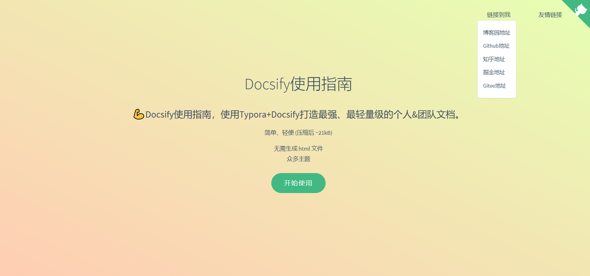

# Docsify-Guide
> 🐱‍🏍Docsify使用指南，使用Typora+Docsify打造最强、最快捷、最轻量级的个人&团队文档。

## Docsify使用教程
- [docsify-github地址](https://github.com/docsifyjs/docsify/#showcase)
- [docsify快速开始-官方教程](https://docsify.js.org/#/zh-cn/quickstart)
- [使用开源文档工具docsify，用写博客的姿势写文档](https://www.cnblogs.com/throwable/p/13605289.html)
- [Docsify使用指南（打造最强、最轻量级的个人&团队文档）](https://www.cnblogs.com/Can-daydayup/p/15413267.html)

## Docsify部署教程
- [Docsify部署IIS](https://www.cnblogs.com/Can-daydayup/p/15779788.html)
- [GitHub Pages](https://docsify.js.org/#/zh-cn/deploy?id=github-pages)
- [GitLab Pages](https://docsify.js.org/#/zh-cn/deploy?id=gitlab-pages)
- [Gitee Pages](https://docsify.js.org/#/zh-cn/deploy?id=gitee-pages)
- [Docker](https://docsify.js.org/#/zh-cn/deploy?id=docker)
- [Firebase 主机](https://docsify.js.org/#/zh-cn/deploy?id=firebase-主机)
- [VPS](https://docsify.js.org/#/zh-cn/deploy?id=vps)
- [Netlify](https://docsify.js.org/#/zh-cn/deploy?id=netlify)
- [ZEIT Now](https://docsify.js.org/#/zh-cn/deploy?id=zeit-now)
- [AWS Amplify](https://docsify.js.org/#/zh-cn/deploy?id=aws-amplify)
- [官方docsify部署教程](https://docsify.js.org/#/zh-cn/deploy)
- [30分钟使用Docsify+Github Pages搭建个人博客 ](https://www.cnblogs.com/Can-daydayup/p/15779888.html)

# JAVA八股文

### 常规八股文

java基础、集合、jvm、并发

MySQL、redis

Spring、SpringBoot、MyBatis

kafka 或 rocketmq 

设计模式

计算机网络、操作系统

**另外，下面的知识点需要根据自己的项目来选择**

ElasticSearch、MongoDB、Netty

分布式相关：SpringCloud、Nacos、Dubbo、Zookeeper、CDN

Docker、k8s云原生相关

### 项目相关

1、项目中常见的问题，例如（保证消息不丢失、消息积压、如何去重、幂等、线上指标、使用了什么设计模式？线程池如何使用的？分布式锁是怎么用的？如何保证数据库redis一致性？秒杀如何实现？为什么选用xx消息队列不用xx？以及一些业务上的问题

2、面试业务场景类题？如何排查慢sql？如何排查oom？如果发现 cpu 100%怎么办？JVM调优怎么做？内存飙高怎么排查？频繁full GC怎么办？内存泄漏怎么排查？实习中实际解决过什么问题？举例说明

在实际面试中，只需要掌握其中两三个解决的问题就完全足够面试了，我这里提供了几十种常见的这种实际问题，包括慢sql实际场景、OOM等，只需要选择几个包装进你的简历项目中

3、八股文背诵版

### 模拟面试

随机从题库抽题，组成面试试卷（？不好实现）

